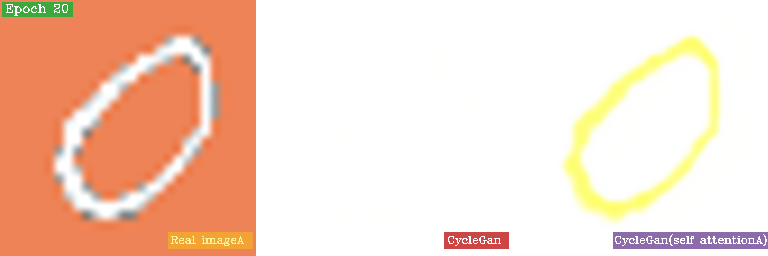
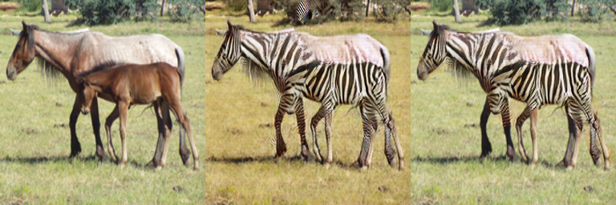
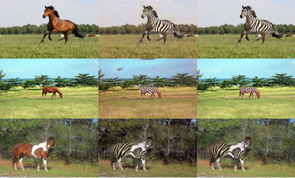
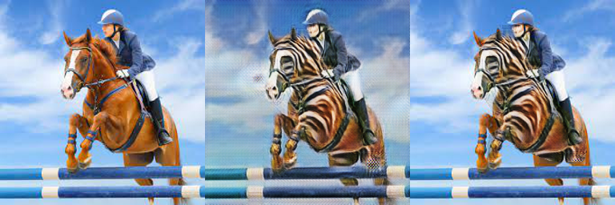

## Introduction
CycleGANSA is an improved version of the CycleGAN model. It includes a self-attention mechanism and semantic segmentation to speed up generation times and fix blurred backgrounds in transformed images. It has been tested on the MNIST and horse2zebra (h2z) datasets.
This work has been published by IEEE and can be accessed [here](https://ieeexplore.ieee.org/document/10361163).


## Results
After adding self-attention and semantic segmentation, the generation speed and quality have significantly improved.

### CycleGAN with self-attention
The generation process is significantly faster compared to the original CycleGAN.



<span style="color: #6c757d;">[Left to Right: Original Image, CycleGAN Output, CycleganSA Output]</span>


### CycleGAN with Semantic Segmentation

  The original CycleGAN often has an issue with a blurred background after style transformation
  

<span style="color: #6c757d;">[Left to Right: Original Image, CycleGAN Output, CycleGANSA Output]</span>

  The background issue has been solved after added semantic segmentation.
 
  
  


<span style="color: #6c757d;">[Left to Right: Original Image, CycleGAN Output, CycleganSA Output]</span>


## Environment
- Ubuntu18.04
- Python 3.8
- CUDA 11.3
- cuDNN 8, NVCC
- Pytorch 1.11.0
- torchvision 0.12.0
- torchaudio 0.11.0


## Usage

### Dataset Structure
```bash
-- datasets
    └── dataset_name
        ├── domain_A
        └── domain_B
```

### Training
To train with a shallow self-attention mechanism:

```bash
python train.py --model_type shallow --dataroot datasets/horse2zebra/ --name h2z_sa_shallow

python train.py --model_type shallow --dataroot datasets/mnist/ --name mnist_sa_shallow
```

To train with a deep self-attention mechanism:
```bash
python train.py --model_type deep --dataroot datasets/horse2zebra/ --name h2z_sa_deep --gpu 0

python train.py --model_type deep --dataroot datasets/mnist/ --name h2z_sa_deep
```

To train without self-attention mechanism:
```bash
python train.py --dataroot datasets/horse2zebra/ --name h2z_sa_shallow

python train.py--dataroot datasets/mnist/ --name mnist_sa_shallow
```

### Training Parameters
- `--dataroot`: Path to the dataset
- `--name`: Specific checkpoint location. (will be saved in checkpoint/{name})
- `--results_dir`: Directory to save the results
- `--gpu-ids`: IDs of GPUs to use, default is 0 for GPU, -1 for CPU
- `--model_type`: shallow | deep | default
    - `shallow`: Use self-attention in shallow CycleGAN
    - `deep`: Use self-attention in deep CycleGAN
    - `default`: Use the original CycleGAN


### Testing
```bash
 python test.py --gpu_ids -1
 python test.py --dataroot datasets/mnist/testA --name mnist_sa_deep --results_dir output/mnist/sa_shallow --direction AtoB
```

### Testing Parameters
- `--dataroot`: Path to the test images, ensure to select images from domain A or B
- `--name`: Specific checkpoint model location. (will be fetched from checkpoint/{name})
- `--results_dir`: Directory to save the results
- `--gpu-ids`: IDs of GPUs to use, default is 0 for GPU, -1 for CPU
- `--direction`: Specify the direction of the transformation, AtoB or BtoA


# References
  - [pytorch-CycleGAN-and-pix2pix](https://github.com/junyanz/pytorch-CycleGAN-and-pix2pix)


